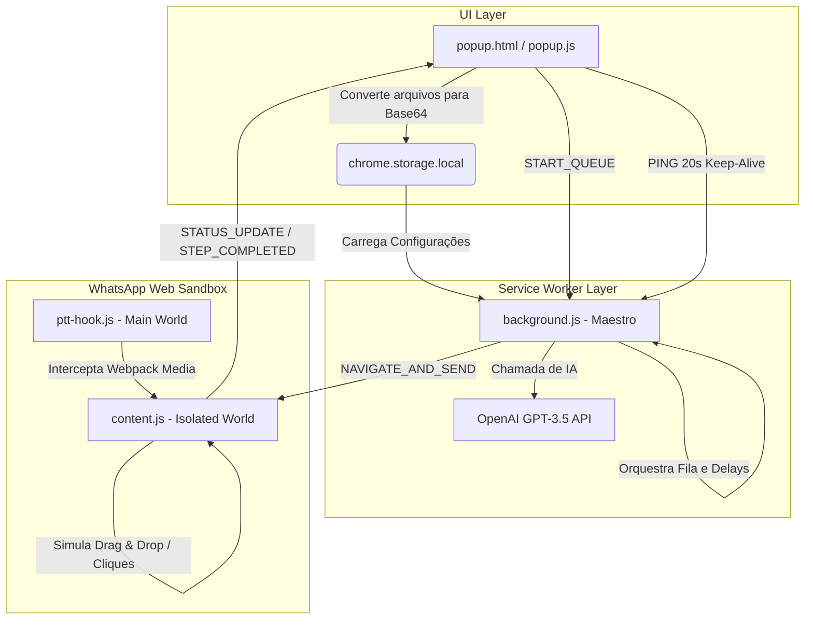

# 🧠 Cyber Disparador (Versão Final - Elite 3.0)
> **Desenvolvido por Agência Cyborg** • *Extensão de Automação Inteligente e Humanizada para WhatsApp Web (Manifest V3)*

Bem-vindo à documentação oficial e abrangente do **Cyber Disparador (Versão Final)**. Este documento foi projetado para detalhar a arquitetura técnica, as decisões de engenharia, os algoritmos anti-banimento e o manual completo de operação desta extensão de nível comercial.

---

## 📌 1. Visão Geral do Projeto

O **Cyber Disparador** é uma extensão para Google Chrome e Microsoft Edge que roda de forma **100% nativa (Vanilla JS)** diretamente no navegador do usuário. Ele automatiza o envio de mensagens, imagens, vídeos e áudios gravados no WhatsApp Web utilizando listas de contatos em formato CSV.

Diferente de robôs de disparo em massa tradicionais (que são facilmente detectados e banidos pelos algoritmos da Meta), o Cyber Disparador foi construído sob uma **filosofia de fidelidade de comportamento humano**, incorporando matemática probabilística de atraso, inteligência artificial para reescrita dinâmica de textos e hooks no próprio pipeline do WhatsApp Web para disfarçar anexos de áudio como gravações reais de voz (Push-To-Talk).

---

## 🗺️ 2. Arquitetura do Sistema e Fluxo de Dados

A extensão obedece ao padrão rígido do **Manifest V3** do Google Chrome, dividindo-se em 4 componentes operando em camadas de isolamento distintas:

### 🗂️ Estrutura dos Arquivos Principais

*   **`manifest.json`**: Arquivo de registro da extensão no Chrome. Configura as permissões de armazenamento local (`storage`), injeção de scripts (`scripting`), hosts de APIs externos e define a injeção do `ptt-hook.js` no contexto de execução principal (`world: "MAIN"`) e do `content.js` no contexto isolado (`world: "ISOLATED"`).
*   **`popup.html` e `style.css`**: Interface gráfica responsiva. Utiliza uma estética limpa, moderna e premium com emulação de classes do Tailwind CSS e variáveis customizadas para uma paleta sóbria (Slate e Royal). Inclui sistema de logs e contador de progresso flutuante.
*   **`popup.js`**: Gerencia o estado do painel, faz a persistência automática das opções na memória local da extensão, faz o parsing (leitura e higienização) do arquivo CSV e converte imagens, vídeos e áudios em strings **Base64 (Data URLs)** para permitir a transmissão de arquivos entre o popup e o Service Worker.
*   **`background.js` (Service Worker)**: O "Maestro" do sistema. Gerencia a fila de envio de forma assíncrona, calcula os delays dinâmicos baseados no tamanho do texto, gera variações inteligentes das mensagens usando a API da OpenAI e coordena a comunicação de eventos.
*   **`content.js` (Content Script - Isolated World)**: Os "braços" da extensão. É injetado no domínio `web.whatsapp.com` para realizar as ações de interface de usuário (abrir chats, colar textos, injetar arquivos e disparar cliques nos botões de envio). Ele também monitora popups de erros de números inexistentes por meio de um `MutationObserver`.
*   **`ptt-hook.js` (Webpack Hook - Main World)**: O segredo tecnológico para os áudios. Ele é injetado no escopo global da página do WhatsApp antes da inicialização do próprio código do WhatsApp Web. Ele sequestra os pacotes Webpack internos para fazer os arquivos `.ogg` enviados parecerem gravações de voz originais da plataforma.

---

## 🛡️ 3. O Sistema Anti-Ban Avançado

A maior virtude da extensão é sua capacidade de mascarar o robô como um ser humano real digitando e enviando mensagens no computador. Isso é feito por meio de três pilares:

### 3.1. A Fórmula do Delay Inteligente e Jitter Extremo
Disparos mecânicos de bots costumam ter tempos rígidos e idênticos (ex: a cada exatos 5 segundos). O WhatsApp detecta esse padrão em minutos. A fórmula matemática aplicada no Cyber Disparador para definir a pausa de envio entre um contato e outro é:

$$\text{Tempo Total de Espera} = \text{Delay Base} + \text{Tempo de Digitação} + \text{Jitter Aleatório}$$

Na prática (no arquivo [background.js](file:///y:/Cyborg/DISPARADOR/VERSAO%20FINAL/background.js#L157-L171)):
1.  **Delay Base**: Configurado pelo operador no painel (padrão de 3000ms a 5000ms).
2.  **Tempo de Digitação**: Adiciona **50ms por caractere** da mensagem final gerada. Se a mensagem possuir 100 caracteres, são somados 5.000ms (5 segundos).
3.  **Jitter Extremo (Fator Aleatório)**: Um gerador probabilístico sorteia a cada envio um valor flutuante entre **15.000ms (15 segundos) e 47.000ms (47 segundos)**.

> [!TIP]
> Essa cadência extremamente instável simula perfeitamente uma pessoa que responde um cliente, para um pouco para respirar, busca uma água, digita um texto mais longo e depois envia a mensagem.

---

## ⚡ 4. Recursos e Lógicas Especiais (Engenharia de Destaque)

### 🎙️ 4.1. Áudio Nativo (Simulação Real de PTT - Push-To-Talk)
Quando você envia um arquivo de áudio comum pelo WhatsApp Web, ele chega para o destinatário como um arquivo cinza anexado (gerando desconfiança e baixa taxa de reprodução). 
O `ptt-hook.js` resolve isso interceptando o ciclo do Webpack da própria Meta. 

*   O script monitora a propriedade `window.webpackChunkwhatsapp_web_client`.
*   Ele substitui as funções nativas de codificação de mídia `prepRawMedia` e `createOpaqueDataForRawMedia`.
*   Se o arquivo de áudio carregado tiver o nome `recorded_audio.ogg`, ele força os atributos `options.isPtt = true` e `options.asPtt = true`.
*   **Resultado**: O áudio chega para o cliente com a cor verde de mensagem gravada na hora, mostrando as ondas sonoras e a foto de perfil do remetente ao lado do botão de Play!

### 🧠 4.2. Reescrevedor Inteligente (IA OpenAI)
Se a Inteligência Artificial estiver ativada nas configurações, a extensão não envia o mesmo texto para todos. Ela utiliza a API da OpenAI para gerar variações reescritas mantendo o contexto.

*   **Tamanho Dinâmico**: Dependendo da ordem do contato na fila, a IA é instruída a limitar ou estender o texto (ex: alternando entre 70 e 150 caracteres) para que as bolhas de chat tenham formatos diferentes na tela do cliente.
*   **Regras Rígidas de Humanização**: O System Prompt força o modelo `gpt-3.5-turbo` a:
    1.  **Remover acentuação gráfica** (escreve "nao", "voce", "ta", "eh") para imitar a pressa natural ao digitar no celular.
    2.  **Utilizar abreviações comuns** (ex: "vc", "tb", "tbm", "pq").
    3.  **Proibir o uso de Emojis** e banir discursos agressivos de vendas ou preços, focando em um contato amigável de relacionamento.
*   **Higienização e Limpeza**: Caso a IA desobedeça as regras, o [background.js](file:///y:/Cyborg/DISPARADOR/VERSAO%20FINAL/background.js#L222-L225) realiza um pós-processamento limpando aspas restantes, forçando remoção de acentos via Normalization Form D (`NFD`) e deletando qualquer emoji residual por expressões regulares (Regex).
*   **Fallback Robusto**: Se a API Key estiver incorreta, sem créditos ou se a OpenAI cair, o sistema entra em modo de segurança imediatamente, disparando a mensagem base com a substituição simples do nome e continuando a fila sem travamentos.

### 👥 4.3. Tratamento Inteligente de Nomes Vazios (Fallback)
É comum termos planilhas onde alguns clientes não possuem o nome registrado, apenas o telefone. O Cyber Disparador possui inteligência gramatical para lidar com isso:
*   Se o nome estiver vazio, a tag `{{nome}}` é eliminada e pontuações remanescentes são corrigidas para evitar bizarrias como `"Olá , tudo bem?"`. O código converte a string para `"Olá, tudo bem?"`.
*   Se a IA estiver ativa, o prompt do robô é alertado que o destinatário é desconhecido, instruindo-o a gerar uma saudação polida e genérica sem usar tags de substituição.

### 📂 4.4. Upload de Mídia Ultra-Resiliente (Drag & Drop + Input Fallback)
Mídias são carregadas como Base64 do popup para o background e depois reconstruídas como arquivos binários reais (`Blob`/`File`) no `content.js`.
Para subir a imagem ou o vídeo, o script executa um complexo pipeline de eventos de UI que simulam o ato de soltar o arquivo no navegador:
1.  Dispara `dragenter` e `dragover` na tela e no elemento `#main`.
2.  Busca o contêiner de drop ativo na tela do WhatsApp.
3.  Executa o evento de `drop` contendo os dados do arquivo via `DataTransfer`.
4.  **Fallback de segurança**: Se a simulação de Drag & Drop não abrir a pré-visualização, a extensão abre o menu de anexo clicando no botão "+", busca o elemento `<input type="file">` oculto do WhatsApp Web, injeta o arquivo diretamente em sua propriedade `.files` e dispara o evento de mudança (`change`).
5.  **Estabilização da Mídia**: O robô aguarda até **2.8 segundos** para a geração e renderização do thumbnail do WhatsApp Web antes de enviar, prevenindo falhas de arquivo corrompido no envio.

### ⏭️ 4.5. Monitor de Erros com Auto-Skip
Se um número carregado no CSV for inválido ou não possuir cadastro no WhatsApp, o WhatsApp Web bloqueia a tela com um aviso.
*   O `content.js` implementa um **`MutationObserver`** vigiando o `document.body` em tempo real.
*   Ao detectar a abertura de um elemento dialog com expressões de erro ("não está no whatsapp", "inválido", "invalid", etc.), o observer intercepta o modal.
*   Ele localiza programaticamente o botão de confirmação ("OK", "Entendi", "Fechar") e dispara um clique para fechar a barreira visual.
*   Envia uma mensagem de `STATUS_INVALID_NUMBER` para o background, fazendo com que ele pule o número atual e inicie a próxima fila em 3 segundos, mantendo a operação rodando mesmo com listas ruins.

### ⏳ 4.6. Keep-Alive à prova de Sleep do Chrome
Por restrições de economia de energia do Google Chrome no Manifest V3, o arquivo `background.js` (Service Worker) entra em hibernação profunda após cerca de 30 segundos sem atividade. Como nossos intervalos anti-banimento podem durar até 1 minuto, o Service Worker seria desativado e os disparos interrompidos.
*   A extensão resolve isso estabelecendo uma troca contínua de pings.
*   O `popup.js` mantém um temporizador ativo a cada 20 segundos chamando a ação `PING`.
*   Isso força o navegador a entender que o Service Worker está realizando um processo crítico contínuo, mantendo a extensão operando infinitamente.

---

## 💻 5. Guia de Instalação (Como Rodar)

Como esta é uma extensão privada e personalizada, ela deve ser instalada diretamente via **Modo de Desenvolvedor** do navegador:

1.  Baixe a pasta compactada e extraia todos os arquivos em uma pasta de fácil acesso (ex: `C:\CyberDisparador\`).
2.  Abra o **Google Chrome** ou o **Microsoft Edge**.
3.  Digite `chrome://extensions` na barra de endereços e pressione Enter.
4.  No canto superior direito, ative a chave **"Modo do desenvolvedor"**.
5.  No canto superior esquerdo, clique no botão **"Carregar sem compactação"** (Load unpacked).
6.  Selecione a pasta onde os arquivos da extensão estão salvos (a pasta raiz que contém o arquivo `manifest.json`).
7.  A extensão aparecerá na lista de ferramentas sob o nome **"Cyborg Disparos"** com o ícone do limão `🍋`.
8.  Fixe o ícone na barra de ferramentas do seu navegador e abra o seu **WhatsApp Web** (`https://web.whatsapp.com`).

---

## 📄 6. Formato do Arquivo CSV

A lista de transmissão deve ser gerada no Excel ou Google Sheets e exportada no formato **CSV (Separado por vírgulas ou ponto e vírgulas)**. Ela deve obedecer rigidamente a seguinte estrutura de colunas na primeira linha (cabeçalho):

| nome | telefone |
| :--- | :--- |
| Ana Silva | 5511999998888 |
| Bruno Souza | 5521988887777 |
| | 5531977776666 |

### 📌 Regras de Formatação do CSV:
*   Os cabeçalhos **`nome`** e **`telefone`** devem estar em letras minúsculas (o parser aceita maiúsculas também, mas a minúscula é ideal).
*   O número de telefone deve conter o **DDI (Código do País)** (ex: `55` para Brasil), o **DDD (Código de Área)** e o número de telefone completo. Não há necessidade de remover manualmente traços ou parênteses, pois a extensão faz essa higienização na importação.
*   Se você não souber o nome de um cliente da lista, basta deixar o campo correspondente em branco (a linha deve começar com uma vírgula de separação, conforme o terceiro registro da tabela acima).

---

## ⚠️ 7. Recomendações e Boas Práticas (Segurança Total)

Para garantir a melhor experiência e blindar seu número contra qualquer tipo de moderação ou bloqueio temporário do WhatsApp:

*   **Evite Listas Frias**: Faça disparos preferencialmente para clientes que já iniciaram uma conversa anterior com o seu número ou que possuem o seu contato salvo na agenda.
*   **Chave de IA Ativa**: Sempre que possível, mantenha o uso do reescrevedor de IA ativo. As variações dinâmicas de texto reduzem a probabilidade de detecção de assinaturas repetitivas.
*   **Evite Abusar da Velocidade**: O delay configurado de fábrica já é seguro. Não tente reduzir o delay base para tempos menores que 3 segundos. A paciência é a melhor aliada para disparos duradouros.
*   **Mantenha a Guia Ativa**: Enquanto os disparos acontecem, mantenha a guia do WhatsApp Web aberta. Você pode navegar em outras abas ou usar outros programas do computador tranquilamente, mas a guia do WhatsApp Web precisa estar em execução no navegador.

---

> **Suporte Técnico e Atualizações**: Em caso de modificações na interface web do WhatsApp pela Meta, os seletores da extensão podem ser atualizados no arquivo `content.js` na propriedade global `SELECTORS`.
